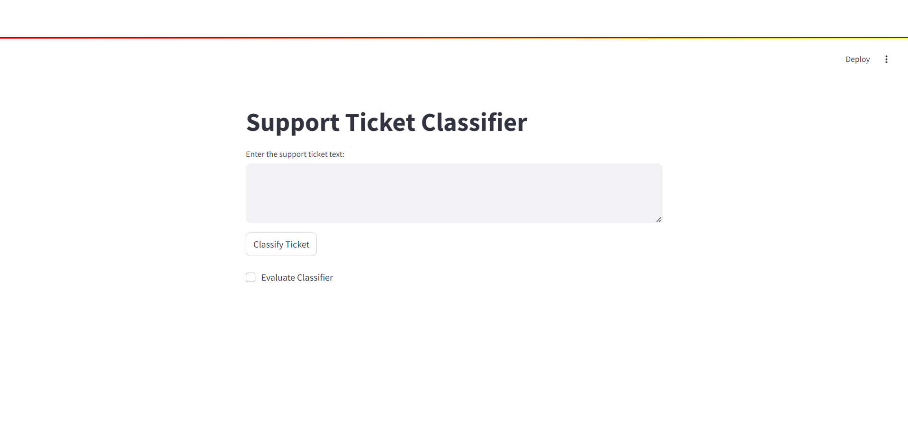
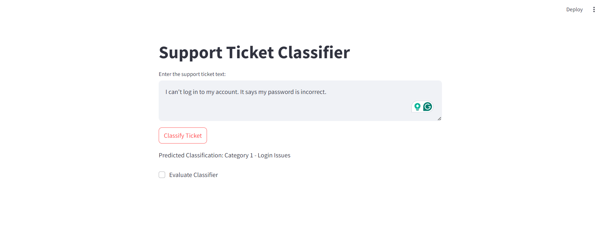
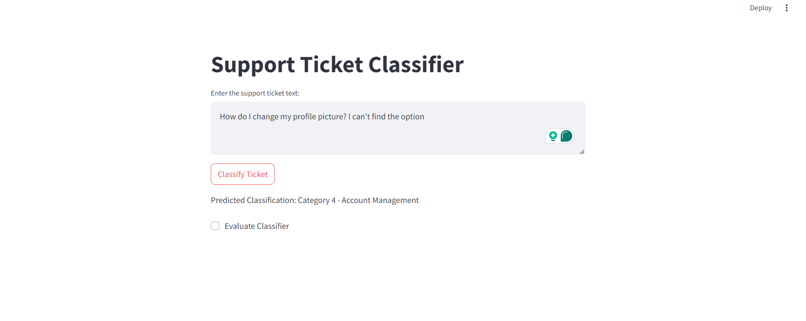

# Support Ticket Classifier

## Overview

The Support Ticket Classifier is a Streamlit application designed to automatically categorize support tickets based on their content. This application uses machine learning to classify tickets into predefined categories, helping streamline ticket management and improve response efficiency.

## Features

- **Text Classification**: Classifies support tickets into one of several predefined categories.
- **Interactive UI**: Allows users to input support ticket text and receive classification results in real time.
- **Evaluation Mode**: Provides an option to evaluate the classifier’s performance using a set of test tickets.

## Categories

The application classifies tickets into the following categories:

1. **Category 1 - Login Issues**: Issues related to login problems, such as incorrect passwords or account lockouts.
2. **Category 2 - App Functionality**: Problems related to app crashes or functionality issues.
3. **Category 3 - Billing**: Discrepancies or issues related to billing and transactions.
4. **Category 4 - Account Management**: Tasks related to managing user accounts and settings.
5. **Category 5 - Performance Issues**: Issues related to app performance, such as buffering or poor quality.

## Technologies Used

- **Streamlit**: For creating the web-based user interface.
- **Transformers**: For generating text embeddings using the `sentence-transformers/all-MiniLM-L6-v2` model.
- **Scikit-learn**: For calculating cosine similarity to match tickets to the most relevant category.
- **PyTorch**: For running the model and processing embeddings.

## Installation


 **Set up a virtual environment:**

    ```bash
    python -m venv venv
    source venv/bin/activate  # On Windows, use `venv\Scripts\activate`
    ```

 **Install dependencies:**

    ```bash
    pip install -r requirements.txt
    ```

 **Run the Streamlit app:**




    ```bash
    streamlit run ticket-supportdash.py
    ```
 **Access the app:**
   Open your browser and navigate to `http://localhost:8501` to start using the Support Ticket Classifier.

## Usage

1. **Enter Support Ticket Text**: Type or paste the support ticket text into the text area provided.
2. **Classify Ticket**: Click the "Classify Ticket" button to get the predicted category for the support ticket.
3. **Evaluate Classifier**: Optionally, check the "Evaluate Classifier" checkbox to run the classifier on a set of predefined test tickets and see its accuracy.

## Example

Here is an example of how the classifier works:

- **Input Ticket**: "I can't log in to my account. It says my password is incorrect."
- **Predicted Classification**: "Category 1 - Login Issues"



## Approach
### Model and Tools

I utilized the `sentence-transformers/all-MiniLM-L6-v2` model, which is a lightweight transformer model known for its efficiency in generating text embeddings. This model helps in transforming text into vector representations, allowing us to compute similarities between different pieces of text.

## Potential Shortcomings

1. **Data Coverage:**
   - The knowledge base may not cover all possible support issues, potentially leading to incorrect or suboptimal classifications.

2. **Model Limitations:**
   - The pre-trained model might not handle all domain-specific terminology or nuances effectively. Further fine-tuning may be necessary for specialized use cases.

3. **Scalability:**
   - The approach might need adjustments to handle larger datasets or more complex categorization tasks efficiently.

## Improvements

1. **Expand Knowledge Base:**
   - Incorporate a broader range of categories and examples to enhance the classifier's robustness and accuracy.

2. **Fine-Tune Model:**
   - Fine-tune the language model on domain-specific data to improve its performance on specialized tasks.

3. **User Feedback Integration:**
   - Implement mechanisms to gather and integrate user feedback, allowing for continuous improvement of the classification system.

## Conclusion
This solution demonstrates a text classification system using RAG with a pre-trained language model. The approach aims to provide meaningful classifications for support tickets, enhancing the overall support process.

Please refer to the provided Jupyter notebook and requirements.txt for a complete setup and further details.

For any questions or suggestions, feel free to reach out to:

- **Email**: patelsaurin2002@gmail.com
- **GitHub**: [saurin16](https://github.com/saurin16)
